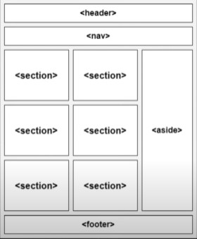
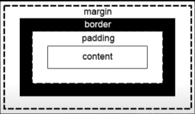
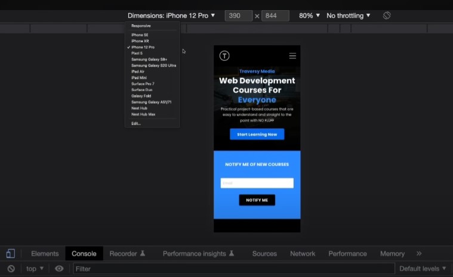
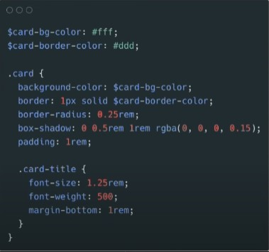
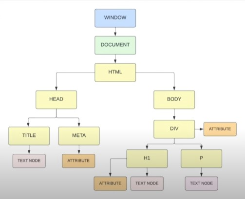
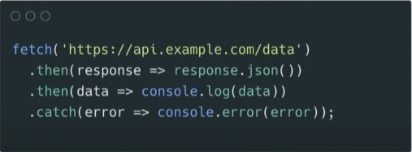

# Coding Tips

### VSCode
1. To create a default html page, in a .html file start with a '!' and hit enter.

### Markdown
1. View markdown files in VSCode using the key bind Ctrl + Shift + v.
2. Use "#" as a quick way to make a Heading. The more "#" the smaller the heading.
3. Insert an image using this syntax  or using an html <'img'> tag.

### HTML
1. Use the following structure for html:

  

2. Imagine all elements in html as a box. The box has content in the middle, surrounded by padding, surrounded by a border, surrounded by the margin.

  

### CSS Styling
1. CSS fundamentals are fonts, colours, box model, positioning.
2. Specificity is based on the selectors used to target the element. Example, id selector has a higher weight than a class selector, which has a higher weight than an element specifier.
3. Use Flexbox and CSS Grid rather than floats to create one and two-dimensional layouts
4. Responsive layouts for mobile. Adjust layout based on size and orientation of their device. Devtools in chrome browser allows selection of device:

  

5. Media queries are also required based on screen size.

##### SASS
1. SASS is a CSS Pre-Processor. Use SASS compiler to compile .sass or .scss files into regular CSS. Provides simple variable syntax, nesting, functions and mixins, importing and partials, and extend/inheritance. Example:

  

##### Frameworks
1. Frameworks save you time when it comes to creating and styling layouts
2. Tailwind
  - Utility-based framework
  - Very popular
  - Easily integrate into projects
2. Bootstrap
  - Component-based framework
  - Includes dynamic JS components
3. Materialize
  - Component-based framework
  - Uses Google Material Design
  - Includes dynamic JS components
4. Bulma
  - Modular (Import what you need)
  - Very lightweight and fast
  - Easy to use
 

### Javascript
1. Understand the DOM structure as a tree of nodes to style, listen to, and apply events:

  

2. Arrow functions sytnax:

  (a) => { return a + 100 }

3. At its core, js is synchronous meaning that everything is executed line by line, one after another. We have ways to write and work with asynchronous code which is useful for websites with http requests. Example:

  

4. JSON is the format used to send data between the client and server.

### UI Design Principles
1. Scale
  - Sizing relative to other elements on the page and in that area
2. Whitespace
  - The spacing between elements. Correct margin, padding, width, height, etc
3. Color & Contrast
  - Text should always be 100% readable
4. Visual Hierarchy
  - Arrange your elements in the order of importance
5. Typography
  - Text typefaces, font styles, and sizing
6. Alignment & Flow
  - Create visual flow. Direct the user's eyes where they need to go

